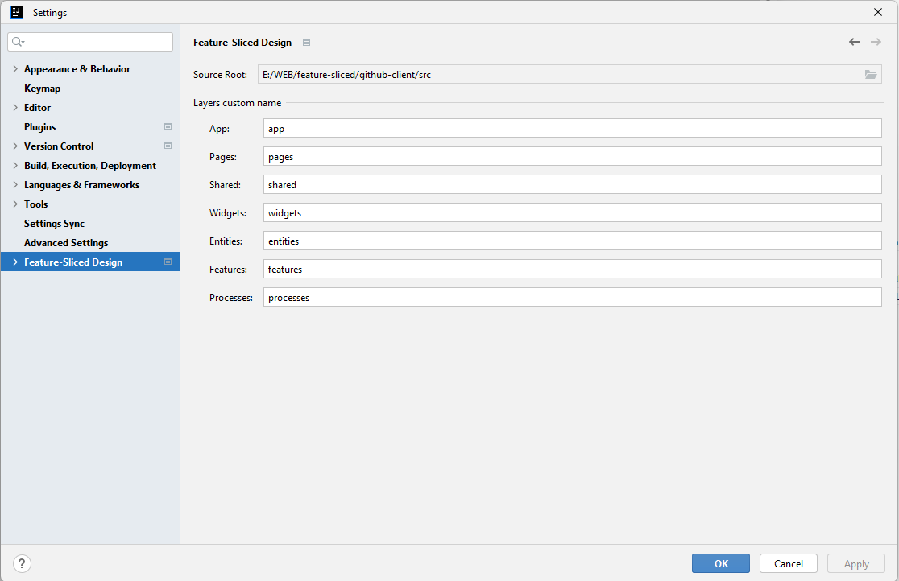
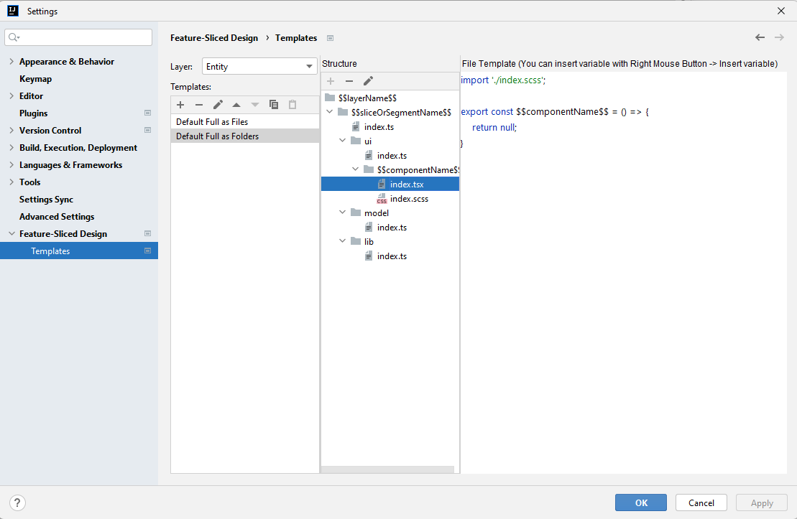
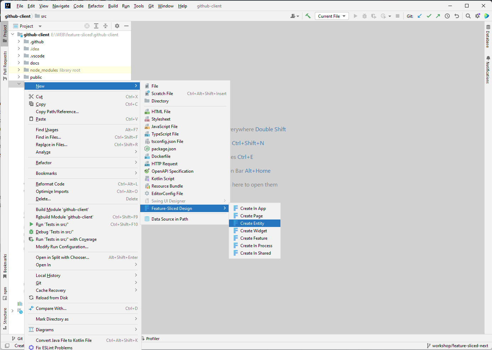
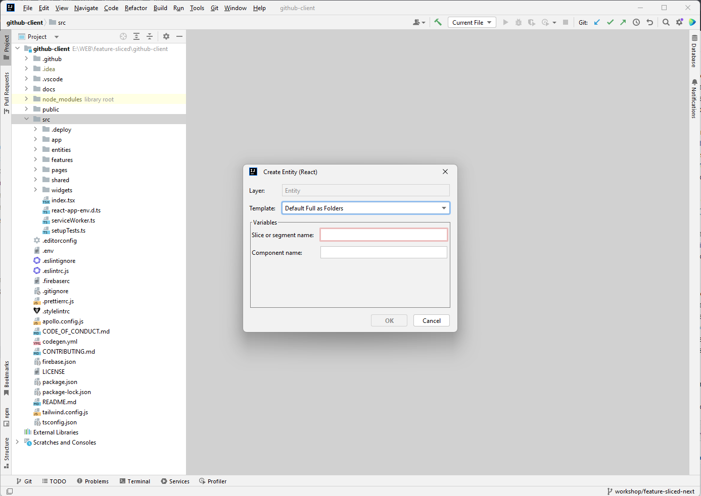

Feature Slices Design Helper
=============

Introduction
------------

<!-- Plugin description -->

[**Feature-Sliced Design**](https://feature-sliced.design/) - architectural methodology for frontend projects.

This plugin will help you with this methodology. Namely, with the flexible creation of slices in layers and segments in slices. 

You can use the default templates or create your own to meet all your project needs.

Supported:
- Any project structure
- Frontend libraries: [Vue](https://vuejs.org/), [React](https://react.dev/).

Features
--------

- Any project structure
- Create Pages
- Create Widgets
- Create Entities
- Create Features
- Create App elements
- Create Shared elements
- Support styles: Pure CSS, Saas, Inline, CSS Modules, @emotion, Styled Components

<!-- Plugin description end -->

Supported IDEs
--------------

**WebStorm** is supported since version 2023.1.    
**Intellij Ultimate** is supported since version 2023.1.    

Installation
------------

- Using IDE built-in plugin system:
    - <kbd>Preferences</kbd> > <kbd>Plugins</kbd> > <kbd>Browse repositories...</kbd> > <kbd>Search for "Feature Sliced Design Helper"</kbd> > <kbd>Install Plugin</kbd>
- Manually:
    - Download the [latest release][latest-release] and install it manually using <kbd>Preferences</kbd> > <kbd>Plugins</kbd> > <kbd>Install plugin from disk...</kbd>

Restart IDE.

Usage
-----

#### Change sources root or layers names

1. Open Settings (Not project Structure) and find Feature-Sliced Design section.   
2. Change source root in Source Root field.   
3. Set own layers names in specified text fields.   
4. Click "Apply" button and close settings.  

#### Templates: Create

1. Open Settings (Not project Structure) and find Feature-Sliced Design section and expand it.   
2. Choose layer what you need.  
3. Create new one by clicking on plus button in toolbar.
4. Enter the name and description of template (name is required) and click "OK" button. This templates will be selected.
5. Create structure for created template: crate file, style or folder by clicking on plus button in toolbar.
6. Enter name (You can insert variables) and select extension (for file and style) and press "OK" button.
7. For created files and styles you can write file template with variables.
8. Click "Apply" button.

#### Templates: Edit

1. Open Settings (Not project Structure) and find Feature-Sliced Design section and expand it.   
2. Choose layer what you need.  
3. Select template by clicking on it in list.
4. Change the name or/and description of template (name is required) and click "OK" button.
5. Change structure for template. You can crate or edit files, styles or folders by clicking on pencil button in toolbar.
6. Click "Apply" button. 

#### Templates: Use

1. Right-Click on the project root or source root (specified in settings or default).
2. Hover on "New" item, then hover on Feature-Sliced Design item.
3. Click on item what you need.
4. Select template.
5. Fill all variables values.
6. Click "OK" button. 

[plugin-website]:      https://plugins.jetbrains.com/plugin/21638-feature-sliced-design-helper
[latest-release]:      https://github.com/Tsyklop/feature-sliced-design-helper/releases/latest